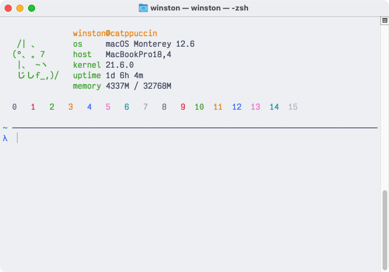

<h3 align="center">
	 
	
	Catppuccin for <a href="https://support.apple.com/guide/terminal/welcome/mac">Terminal.app</a>
	
</h3>

	
	
	

	

## Previews

🌻 Latte

🪴 Frappé

🌺 Macchiato

🌿 Mocha

## Usage

1. Download your preferred flavor from [`themes/`](./themes/).
2. Open Terminal.app's settings with <kbd>⌘ + ,</kbd> (or through **Terminal** > **Settings...** in the menubar).
3. Open the "Profiles" tab.
4. Click on the `...` icon below the list of themes in the left panel, and select "Import...".
5. Upload the file downloaded in Step 1.

## 💝 Thanks to

- [winston](https://github.com/nekowinston)
- [uncenter](https://github.com/uncenter)

&nbsp;

	

	Copyright &copy; 2021-present <a href="https://github.com/catppuccin" target="_blank">Catppuccin Org</a>

	

